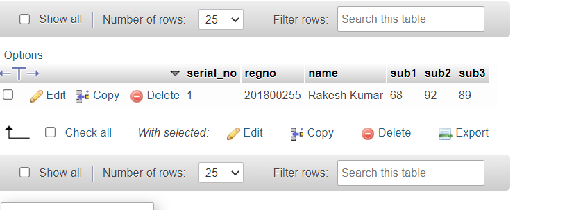

# CREATE USER PAGE:

# LOGIN:

# Home page

# Data Entry page

# Database after adding data

# Data Reterival page

# update page

# Data updated in database

# Favourite players page

# Logout button

